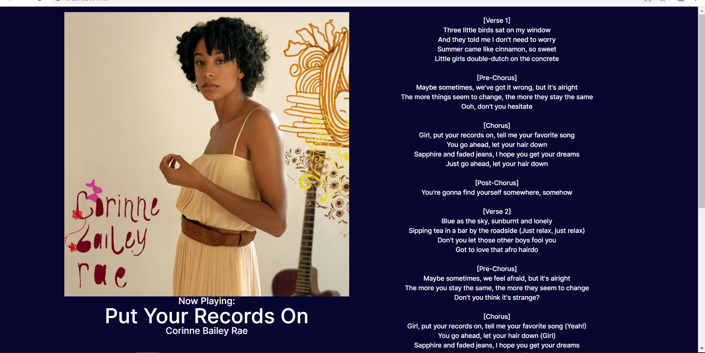

# Spotify Live Lyrics

## Description
Connects with a user's Spotify account to display currently playing track and corresponding Genius lyrics. 

[Spotify Live Lyrics](https://swetha-sankar.github.io/spotify_lyric_dash/)

## Note: 
If the lyrics aren't displaying (CORS), please follow the instructions on this [page][https://stackoverflow.com/questions/14195530/how-to-display-raw-json-data-on-a-html-page] and reopen the above link

For Windows + Chrome users, please use Windows Key + R and enter chrome.exe --user-data-dir="C:/Chrome dev session" --disable-web-security and then open the website link

## Resources
- Bootstrapped with Create React App
- Bulma CSS: https://bulma.io/
- Spotify for Developers: https://developer.spotify.com/
- Genius API: https://docs.genius.com/
- Genius Lyrics API: https://github.com/farshed/genius-lyrics-api

Sample of Lyrics screen:

[https://stackoverflow.com/questions/14195530/how-to-display-raw-json-data-on-a-html-page]: https://stackoverflow.com/questions/3102819/disable-same-origin-policy-in-chrome

